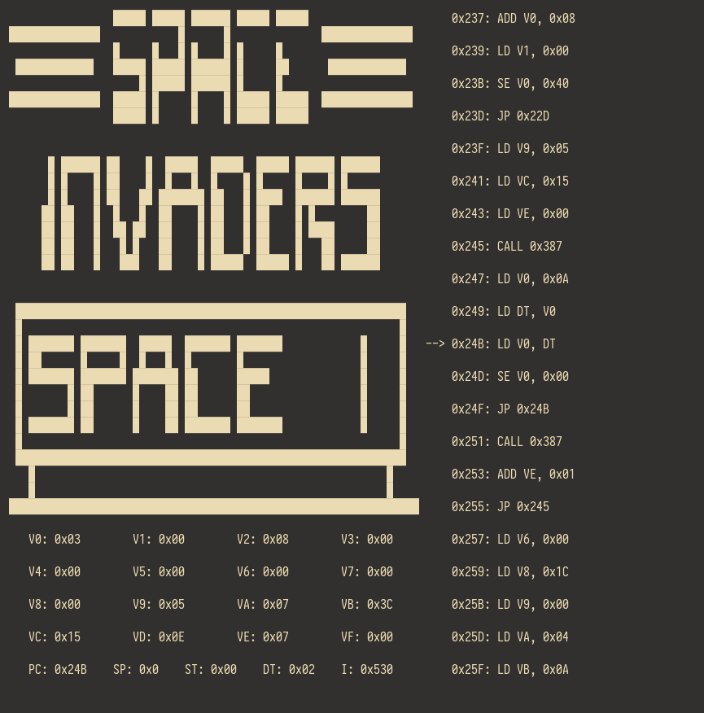

# chip

A terminal-based [CHIP-8][7] emulator with ROM game files from [Zophar's Domain][8].

## Features

- Adjustable CPU frequency
- Address and opcode types
- Bit-based pixel buffer
- Basic stepping debugger with CPU and assembly view
- Pause and reset functionality

## Screenshots




## Usage

1. [Install Rust.][9]
2. Run `cargo run --release --hz 500 rom/<FILE>` from the project directory.
3. Input keys are mapped as follows [(diagram from here)][3]

```

    Keyboard              CHIP-8 Input
╔═══╦═══╦═══╦═══╗      ╔═══╦═══╦═══╦═══╗
║ 1 ║ 2 ║ 3 ║ 4 ║      ║ 1 ║ 2 ║ 3 ║ C ║
╠═══╬═══╬═══╬═══╣      ╠═══╬═══╬═══╬═══╣
║ Q ║ W ║ E ║ R ║      ║ 4 ║ 5 ║ 6 ║ D ║
╠═══╬═══╬═══╬═══╣ ===> ╠═══╬═══╬═══╬═══╣
║ A ║ S ║ D ║ F ║      ║ 7 ║ 8 ║ 9 ║ E ║
╠═══╬═══╬═══╬═══╣      ╠═══╬═══╬═══╬═══╣
║ Z ║ X ║ C ║ V ║      ║ A ║ 0 ║ B ║ F ║
╚═══╩═══╩═══╩═══╝      ╚═══╩═══╩═══╩═══╝

      <ESC>       ===>       QUIT
        +         ===>     HZ += 10
        -         ===>     HZ -= 10
        n         ===>       STEP
        r         ===>       RESET
     <SPACE>      ===>       PAUSE

```

## References

- [Chip-8 Design Specification][0]
- [Chip-8-Emulator by @alexanderdickson][1]
- [chip8 by @wernsey][2]
- [CHIP-8 Technical Reference by @mattmikolay][3]
- [Cowgod's Chip-8 Technical Reference v1.0][4]
- [Writing a Chip 8 Emulator by Craig Thomas][5]
- [Mastering Chip-8 by Matthew Mikolay][6]
- [CHIP-8 Wikipedia article][7]
- [Chip-8 Games Pack][8]

[0]: http://www.cs.columbia.edu/~sedwards/classes/2016/4840-spring/designs/Chip8.pdf 
[1]: https://github.com/alexanderdickson/Chip-8-Emulator
[2]: https://github.com/wernsey/chip8
[3]: https://github.com/mattmikolay/chip-8/wiki/CHIP%E2%80%908-Technical-Reference
[4]: http://devernay.free.fr/hacks/chip8/C8TECH10.HTM
[5]: http://craigthomas.ca/blog/2014/06/21/writing-a-chip-8-emulator-part-1/
[6]: http://mattmik.com/files/chip8/mastering/chip8.html
[7]: https://en.wikipedia.org/wiki/CHIP-8
[8]: https://www.zophar.net/pdroms/chip8/chip-8-games-pack.html
[9]: https://rustup.rs/ 
[10]: https://github.com/redox-os/termion 
